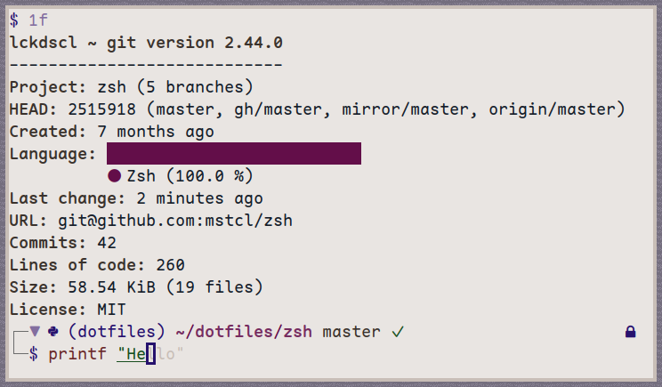

# zsh

__lckdscl's opinionated zsh configuration__




## Features

Functional, speedy, and clean.

## Get started

### Cloning

```sh
$ git clone -b master https://github.com/mstcl/zsh
$ cd zsh
```

### Configuration

```sh
$ git checkout -B prod
```

Read through what's available to configure in `host_vars/localhost.yml` and
edit it.

### Installing

When you're happy:

```sh
$ ansible-playbook main.yml
```

## Updating

```sh
$ git checkout master; git pull origin master; git checkout prod; git merge master
```

Work through conflicts if needed.

## Troubleshooting

If you use `XDG_DATA_HOME` and `XDG_CONFIG_HOME`, but they're empty, you might
have to set those environment variables the first time you run the playbook:

```sh
$ XDG_DATA_HOME=<> XDG_CONFIG_HOME=<> ansible-playbook main.yml
```

## Keybindings

Move forward (word): `Ctrl-F`
Move previous (word): `Ctrl-B`

Move forward (char): `Alt-F`
Move previous (char): `Alt-B`

Toggle sudo (insert): `Ctrl-X`
Toggle sudo (normal): `<Esc><Esc>` (only if vimode is enabled)

Toggle process bg <-> fg: `Ctrl-Z`

Accept autosuggestion: `Ctrl-E`

Repeat last command: `Ctrl-K`

FZF files/dir search: `Ctrl-T`
FZF history search: `Ctrl-R`
